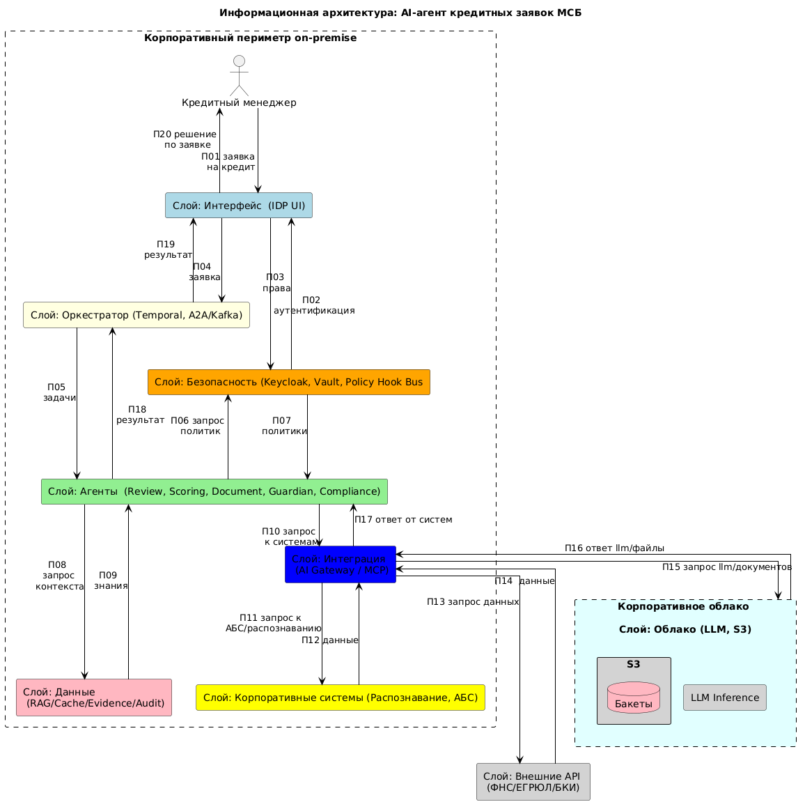
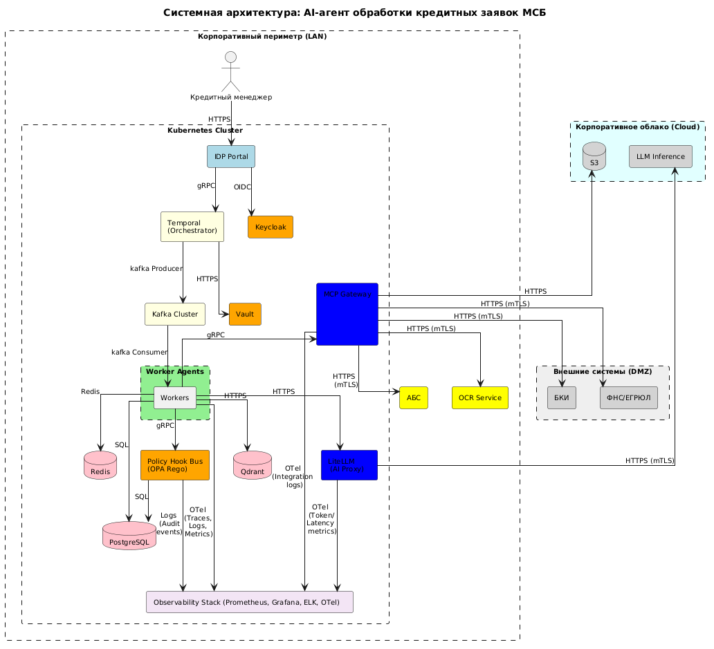

**1\. Общие сведения о проекте**

**1.1 Глоссарий**

| **Термин / Система**                       | **Назначение и определение**                                                                                                                                                                       |
| ------------------------------------------ | -------------------------------------------------------------------------------------------------------------------------------------------------------------------------------------------------- |
| **AI Native**                              | Подход к разработке, при котором бизнес-процессы и ИТ-архитектура изначально проектируются вокруг возможностей автономных AI-агентов, а не просто автоматизируют устаревшие ручные процессы.       |
| **IDP (Integrated Development Platform)**  | Интегрированная платформа разработки - единая среда и точка пересечения Цикла намерения (Intent Loop) и Цикла реализации (Implementation Loop).                                                    |
| **Intent Loop**                            | Цикл намерения - этап, на котором человек (Product Engineer) формулирует бизнес-цель, проводит Discovery и создает машиночитаемый контракт (SDD).                                                  |
| **Implementation Loop**                    | Цикл реализации - этап, на котором AI-агенты автономно выполняют задачи на основе SDD в изолированной среде исполнения.                                                                            |
| **Mob Elaboration**                        | Коллективная проработка спецификации (60-90 мин), где кросс-функциональная команда совместно с ИИ-ассистентом превращает артефакты Discovery в полноценный черновик SDD.                           |
| **SDD (Specification-Driven Development)** | Методология, при которой машиночитаемая спецификация является первичным контрактом исполнения для AI-агентов, фиксируя не только «что» построить, но и бизнес-гипотезу, политики и план валидации. |
| **Outcome Check**                          | Проверка достижения измеримого бизнес-результата (гипотезы результата) после деплоя изменения агентом в промышленную среду.                                                                        |
| **AI Agent Hub**                           | Изолированная среда исполнения агентов (AI-хаб) внутри IDP, обеспечивающая песочницы, квоты и контроль действий.                                                                                   |
| **Evidence Bundle**                        | Пакет доказательств завершения агентной задачи, включающий результаты evals, audit-лог, отчет о стоимости токенов и артефакты валидации.                                                           |
| **Guardian Agent**                         | Агент-страж: обеспечивает поведенческий контроль, эскалацию аномалий и обнаружение дрейфа (drift detection) в работе других агентов.                                                               |
| **Review Agent**                           | Субагент, выполняющий автоматизированное критическое ревью кода и артефактов перед слиянием (merge) в основную ветку.                                                                              |
| **R-level (R0-R5)**                        | Риск-αдаптивная лестница разрешений агента (от R0: только чтение, до R5: полная автономия в песочнице), динамически зависящая от критичности, риска и сложности задачи.                            |
| **Policy Hook Bus**                        | Шина хуков политик (Policy as Code) - механизм проверки и принудительного исполнения (enforcement) правил безопасности и compliance для действий AI-агента в режиме реального времени.             |
| **MCP (Model Context Protocol)**           | Стандартизированный протокол доступа AI-агента к внешним инструментам, API и корпоративным данным.                                                                                                 |
| **A2A (Agent-to-Agent)**                   | Протокол межагентной координации, передачи фаз задачи и обмена типизированными артефактами между Оркестратором и субагентами.                                                                      |

**1.2 Описание проекта**

Проект решает задачу автоматизации end-to-end обработки кредитных заявок малого и среднего бизнеса (МСБ) с сокращением lead time с 5-7 дней до 4 часов для 80% заявок.

Вместо последовательной ручной обработки (оператор → андеррайтер → скоринг → риск-менеджер) выстраивается мультиагентная оркестрация в контуре IDP, где:

- Orchestrator Agent декомпозирует заявку и координирует субагентов
- Document Agent извлекает и валидирует документы через MCP
- Scoring Agent запускает скоринг-модель и интерпретирует результат
- Compliance Agent проверяет соответствие 152-ФЗ, ЦБ РФ, AML
- Review Agent ревьюит решение перед merge в production
- Guardian Agent контролирует поведение всей системы в runtime

Результат проекта:

- Сокращение lead time с 5-7 дней до 4 часов (80% заявок)
- Снижение операционных затрат на обработку заявки на 60%
- 100% compliance с 152-ФЗ и требованиями ЦБ РФ через Policy as Code
- Полный append-only audit всех действий агентов (7 лет retention)
- Адаптивная автономия R2-R3 с human-in-the-loop на критических решениях

Заказчик: Блок «Кредитование МСБ»  
Потребители: кредитные менеджеры, андеррайтеры, риск-менеджеры

**1.3 Ограничения и допущения**

- Все ПДН обрабатываются в контуре РФ (152-ФЗ)
- Использование только отечественных LLM или self-hosted open-source
- Уровень автономии агента - не выше R3 (auto-merge только при прохождении evals)
- Все финансовые транзакции требуют human-in-the-loop (R1)
- Audit retention - 7 лет (стандарт ЦБ РФ)
- Развёртывание в Kubernetes (Cloud / on-prem)

**2\. Бизнес-архитектура**

**2.1 Требования**

- Автоматизировать end-to-end обработку кредитной заявки МСБ
- Обеспечить R-level не выше R3 для production-операций
- Реализовать Policy Hook Bus с федеративными хуками (baseline + domain)
- Обеспечить human-in-the-loop Decision Map на 5 точках валидации
- Реализовать append-only audit с криптографической целостностью (hash-chain)
- Интегрировать внешние системы (БКИ, ФНС, ЕГРЮЛ) через MCP-серверы

**2.2 Целевой бизнес-процесс**

Точка входа: Кредитный менеджер подаёт заявку через web-интерфейс IDP

- Подача заявки: Менеджер загружает пакет документов и заполняет анкету
- Discovery-фаза: Orchestrator валидирует SDD, определяет класс применимости (AI-Native), назначает R-level
- Параллельное исполнение:
  - Document Agent через MCP извлекает данные из PDF
  - Scoring Agent вызывает скоринг-модель через GenAI-Ready API
  - Compliance Agent проверяет ПДН, AML, ФНС/ЕГРЮЛ
- Policy Hook Bus применяет хуки до/после каждого действия
- Review Agent формирует структурированное ревью решения
- Guardian Agent проверяет аномалии поведения
- Human-in-the-loop: Андеррайтер утверждает решение для заявок > 5 млн ₽ или с risk score > порога
- Evidence Bundle формируется и сохраняется в Postgres Pro + S3
- Outcome Check через 14 дней: подтверждение бизнес-метрики

Управление SDD:

- Product Engineer разрабатывает SDD на тестовом стенде
- После Mob Elaboration SDD проходит ревью Review Agent
- CI/CD pipeline валидирует схему SDD (PDLC Semantic Layer)
- SDD деплоится в Specification Registry IDP

Интеграции:

- БКИ, ФНС, ЕГРЮЛ - через MCP-серверы с mTLS
- АБС (автоматизированная банковская система) - через GenAI-Ready API
- Keycloak - аутентификация пользователей
- Vault - управление секретами агентов
- Kafka - поток сообщений для оркестрации, событий аудита

**3\. Описание архитектурного решения**

**3.1 Описание предложенного подхода**

- Мультиагентная оркестрация: Orchestrator + 5 специализированных субагентов с изолированными контекстными окнами (принцип Mixture of Experts)
- IDP как точка пересечения: Единая платформа связывает Intent Loop (Product Engineer, андеррайтер) и Implementation Loop (агенты)
- Policy as Code: Все требования 152-ФЗ, ЦБ РФ, OWASP закодированы как OPA Rego policies и enforce через Policy Hook Bus
- Адаптивная лестница R0-R5: R-level пересчитывается runtime через триаду «критичность × риск × сложность»
- MCP для инструментов: Все внешние API обёрнуты в MCP-серверы с типизированными контрактами Эффективный
- A2A для координации: Межагентная передача фаз через A2A-брокер с валидацией схемы
- Append-only audit: JSONL-лог с hash-chain, архивация в S3 с object lock (7 лет)
- Real-time Explainability: Каждое действие R2+ сопровождается структурированным объяснением (бюджет <500 мс)
- Контейнеризация: Развёртывание в Kubernetes (Cloud / on-prem) с изоляцией namespace per session
- Evidence Bundle: Пакет доказательств завершения (code changes, evals, token cost, audit pointer, explanation artifact)

**3.2 Информационная архитектура**

| Код | Объект данных | Источник | Получатель | Сущности в потоке | Описание (когда и зачем происходит) | Тип | Протокол | Нагрузка |
|---|---|---|---|---|---|---|---|---|
| П01 | Заявка на кредит | Кредитный менеджер | Слой: Интерфейс (IDP UI) | JSON: анкета + пакет документов | Шаг 1. Менеджер загружает анкету и документы через IDP UI и инициирует процесс. | Request | HTTPS | ~5 МБ |
| П02 | Запрос аутентификации | Слой: Интерфейс (IDP UI) | Слой: Безопасность | {user_id, mfa_challenge, session_id} | Шаг 2. IDP инициирует аутентификацию пользователя в корпоративном IdP (Keycloak). | Request | OIDC/OAuth2 | ~1 КБ |
| П03 | JWT-токен с правами | Слой: Безопасность | Слой: Интерфейс (IDP UI) | {access_token, roles, r_level, permissions} | Шаг 3. Keycloak возвращает JWT с ролями и вычисленным R-level для доступа к flows. | Response | OIDC | ~2 КБ |
| П04 | Заявка на обработку | Слой: Интерфейс (IDP UI) | Слой: Оркестратор | A2A: {task_id, spec_pointer, context_bundle, user_jwt} | Шаг 4. IDP валидирует заявку и передает намерение Оркестратору через A2A/Kafka. | Request | A2A (JSON-RPC) | ~20 КБ |
| П05 | Метрики сессии (старт) | Слой: Оркестратор | Слой: Наблюдаемость | {session_id, token_budget, r_level, start_time} | Шаг 5. Оркестратор инициализирует сессию, фиксируя бюджет токенов и R-level для последующего Circuit Breaker. | Event | HTTPS / OTel | ~2 КБ |
| П06 | Декомпозиция задач | Слой: Оркестратор | Слой: Агенты | A2A: {task_id, subtasks: [...], spec_pointer, sandbox_profile} | Шаг 6. Оркестратор декомпозирует заявку на подзадачи и маршрутизирует их специализированным агентам. | Request | A2A (JSON-RPC) | ~10 КБ |
| П07 | Запрос политик | Слой: Агенты | Слой: Безопасность | {action: "pdn_process", context, policy_ids: ["152-FZ", "CBR-AML"]} | Шаг 7. Агент запрашивает проверку политик безопасности и compliance-правил перед выполнением действия. | Request | gRPC + mTLS | ~5 КБ |
| П08 | Политики и разрешения | Слой: Безопасность | Слой: Агенты | {decision: ALLOW/DENY/MODIFY/ESCALATE, policies, r_level} | Шаг 8. Policy Hook Bus возвращает мандатное решение (OPA Rego) и активные ограничения. | Response | gRPC + mTLS | ~5 КБ |
| П09 | Аудит политик | Слой: Безопасность | Слой: Наблюдаемость | {event_id, policy_id, decision, r_level, timestamp} | Шаг 9. Фиксация факта срабатывания guardrails (152-ФЗ, ЦБ) в реальном времени для compliance-отчетности. | Event | HTTPS / Kafka | ~2 КБ |
| П10 | Запрос контекста | Слой: Агенты | Слой: Данные | {query_vector, collection: "credit_policies", top_k: 5} | Шаг 10. Агент запрашивает корпоративные знания и контекст из RAG/Cache для принятия решения. | Request | HTTPS | ~5 КБ |
| П11 | Корпоративные знания | Слой: Данные | Слой: Агенты | {context_documents, policies, patterns} | Шаг 11. RAG возвращает релевантные документы, политики кредитования и паттерны обработки. | Response | HTTPS | ~50 КБ |
| П12 | Запрос к системам | Слой: Агенты | Слой: Интеграция | MCP request: {tool_id: "ocr_service.extract", params: {file_uri}} | Шаг 12. Агент запрашивает доступ к корпоративным или внешним системам через MCP Proxy. | Request | MCP (HTTPS) | ~10 КБ |
| П13 | Трассировка вызова (старт) | Слой: Интеграция | Слой: Наблюдаемость | {trace_id, tool_id, masked_params, agent_id} | Шаг 13. Фиксация начала выполнения инструмента с маскированием чувствительных параметров (ПДН). | Event | HTTPS / OTel | ~5 КБ |
| П14 | Запрос к АБС/распознаванию | Слой: Интеграция | Слой: Корп. системы | HTTPS POST: {subject_id, consent_token, query_type} | Шаг 14. MCP Proxy проксирует запросы к АБС (банковское ядро) и сервису распознавания документов. | Request | HTTPS + mTLS + JWT | ~50 КБ |
| П15 | Данные от корп. систем | Слой: Корп. системы | Слой: Интеграция | {credit_history, account_data, recognized_text} | Шаг 15. АБС возвращает данные о счетах, сервис распознавания — извлечённый текст из документов. | Response | HTTPS + mTLS | ~100 КБ |
| П16 | Запрос внешних данных | Слой: Интеграция | Слой: Внешние API | HTTPS POST: {inn, ogrn, query_type: "entity_verification"} | Шаг 16. MCP Proxy запрашивает данные из внешних реестров (ФНС, ЕГРЮЛ, БКИ) для верификации. | Request | HTTPS + mTLS | ~30 КБ |
| П17 | Данные от внешних API | Слой: Внешние API | Слой: Интеграция | {entity_data, credit_score, registration_status} | Шаг 17. Внешние API возвращают данные о контрагенте, кредитную историю и статус регистрации. | Response | HTTPS + mTLS | ~50 КБ |
| П18 | Запрос LLM/документов | Слой: Интеграция | Слой: Облако | OpenAI-compatible: {model, messages} + S3 GET: {bucket, key} | Шаг 18. LiteLLM проксирует запрос к LLM для инференса, S3 — загрузка/выгрузка документов. | Request | HTTPS + mTLS | ~50 КБ (LLM) + до 200 МБ (S3) |
| П19 | Ответ LLM/файлы | Слой: Облако | Слой: Интеграция | {response: "Одобрить", confidence} + S3 file: {file_uri} | Шаг 19. LLM возвращает решение по скорингу, S3 подтверждает обработку файлов. | Response | HTTPS + mTLS | ~50 КБ (LLM) + до 200 МБ (S3) |
| П20 | Ответ от систем | Слой: Интеграция | Слой: Агенты | {tool_result, status: "success", data} | Шаг 20. MCP Proxy возвращает агентам агрегированные результаты от всех вызванных корпоративных и внешних систем. | Response | MCP (HTTPS) | ~100 КБ |
| П21 | Трассировка и логи (итог) | Слой: Агенты | Слой: Наблюдаемость | {trace_id, tool_calls, eval_results, latency, token_cost} | Шаг 21. По завершении действия агент отправляет структурированные логи, результаты evals и трассировку для анализа качества. | Event | HTTPS / OTel | ~10–50 КБ |
| П22 | Результат обработки | Слой: Агенты | Слой: Оркестратор | A2A: {task_id, result, evidence_bundle, eval_results} | Шаг 22. Агенты возвращают Оркестратору результаты обработки с полным Evidence Bundle (контракт завершения). | Response | A2A (JSON-RPC) | ~100 КБ |
| П23 | Дашборды и алерты | Слой: Наблюдаемость | Слой: Интерфейс (IDP UI) | {dashboard_data, guardian_alerts, real_time_explainability} | Шаг 23. Система наблюдаемости визуализирует статус задач, Real-time Explainability и алерты Guardian Agent для администратора/HITL. | Response | HTTPS / WebSocket | ~20–100 КБ |
| П24 | Решение по заявке | Слой: Интерфейс (IDP UI) | Кредитный менеджер | JSON: {application_id, decision, risk_score, explanation, next_steps} + файлы | Шаг 24. IDP Portal визуализирует финальное решение с объяснением для менеджера, замыкая бизнес-цикл. | Response | HTTPS | ~10 КБ |

**3.3 Системная архитектура**

**3.3.1 Масштабирование**  
 Горизонтальное масштабирование Worker Agents через Kubernetes HPA.

Kafka обеспечивает масштабирование потребителей по partition.

PostgreSQL - primary/replica; Redis - Sentinel/Cluster; Qdrant - sharding/replication.

**3.4 Схема развёртывания (необязательно)**

**4\. Реализация**

**4.1 Требования к реализации**

- Стек и фреймворки: Python 3.11+, LangGraph (оркестрация), FastAPI (MCP-прокси), OPA Rego (Policy Hook Bus).
- Идемпотентность: Все инструменты (MCP), вызываемые агентами, должны быть идемпотентными или принимать idempotency_key (критично для long-running сессий и retry-логики).
- Управление секретами: Жесткий запрет на hardcoded secrets. Все API-ключи и сертификаты запрашиваются из HashiCorp Vault эфемерно (TTL = длительность сессии).
- Изоляция: Развертывание в выделенных K8s namespaces (ns-ai-agent-hub, ns-data-layer) с применением Network Policies (deny-all по умолчанию) и Security Context (non-root, read-only root fs).
- Наблюдаемость: Обязательная инструментация OpenTelemetry для трассировки A2A-взаимодействий и вызовов MCP. Логи в структурированном JSON.
- Policy as Code: Все хуки политик (152-ФЗ, ЦБ РФ, OWASP) должны быть закоммичены в Git, покрыты unit-тестами и проходить ревью как код.

**4.2 Доработка систем вне зоны команды**

| **Система**               | **Суть доработки**                                                                                                                                | **Ответственный за разработку**        | **Кто будет поддерживать** |
| ------------------------- | ------------------------------------------------------------------------------------------------------------------------------------------------- | -------------------------------------- | -------------------------- |
| **АБС (Банковское ядро)** | Разработка GenAI-Ready API обёрток: добавление семантических описаний (аналог OpenAPI), поддержка mTLS и JWT-авторизации для агентных вызовов.    | Команда развития АБС                   | Команда эксплуатации АБС   |
| **БКИ (НБКИ/ОКБ)**        | Развертывание и настройка MCP-сервера с поддержкой mTLS, rate-limiting и интеграцией с ЕСА Sber-Yandex ID для передачи токенов согласия субъекта. | Интеграционная команда / Платформа API | Интеграционная команда     |
| **Cloud / DevOps**        | Выделение K8s кластера, настройка S3 bucket с включенным Object Lock (WORM) для хранения аудита, настройка квот GPU.                              | DevOps / Cloud Platform                | DevOps / Cloud Platform    |
| **Платформа ИБ**          | Настройка политик HashiCorp Vault для эфемерной выдачи секретов агентам и настройка MFA в Keycloak для ролей HITL (андеррайтеры).                 | IAM / ИБ-архитекторы                   | IAM / ИБ-команда           |

**4.3 Технический долг (если есть)**

- **Пользователи**: Аутентификация через Keycloak + ЕСА Sber-Yandex ID. Для ролей Human-in-the-loop (HITL, например, андеррайтеры) обязательно включение MFA.
- **Сервисы (межсервисное взаимодействие)**: Mutual TLS (mTLS) между всеми компонентами внутри K8s кластера (ns-ai-agent-hub ↔ ns-data-layer ↔ внешние MCP-серверы).
- **Управление секретами**: HashiCorp Vault. Агенты получают эфемерные токены (TTL = время сессии) через Service Accounts с минимальными привилегиями (Principle of Least Privilege).
- **Авторизация действий**: Риск-адаптивная лестница (R0-R5) маппится на RBAC-роли. Действия агентов перехватываются Policy Hook Bus (OPA Rego) для проверки прав до исполнения.

**5\. Информационная безопасность**

**5.1 Аутентификация и авторизация пользователей и сервисов**

- Пользователи: Аутентификация через Keycloak + ЕСА Sber-Yandex ID. Для ролей Human-in-the-loop (HITL, например, андеррайтеры) обязательно включение MFA.
- Сервисы (межсервисное взаимодействие): Mutual TLS (mTLS) между всеми компонентами внутри K8s кластера (ns-ai-agent-hub ↔ ns-data-layer ↔ внешние MCP-серверы).
- Управление секретами: HashiCorp Vault. Агенты получают эфемерные токены (TTL = время сессии) через Service Accounts с минимальными привилегиями (Principle of Least Privilege).
- Авторизация действий: Риск-адаптивная лестница (R0-R5) маппится на RBAC-роли. Действия агентов перехватываются Policy Hook Bus (OPA Rego) для проверки прав до исполнения.

**5.2 Доступ к внешним ресурсам и DMZ УКП**

| Источник  | Адрес получателя | Порт получателя | Протокол           | Описание потребности                                                   |
| --------- | ---------------- | --------------- | ------------------ | ---------------------------------------------------------------------- |
| MCP Proxy | БКИ (НБКИ/ОКБ)   | 443             | HTTPS (mTLS + JWT) | Запрос кредитной истории. Требуется передача токена согласия субъекта. |
| MCP Proxy | ФНС / ЕГРЮЛ      | 443             | HTTPS (mTLS)       | Проверка контрагента в госреестрах через защищённый канал/СМЭВ.        |

**6\. Нефункциональные требования и дополнительная информация**

| N   | Требование                                                    | Описание реализации                                                                                                                                                                                                                          |
| --- | ------------------------------------------------------------- | -------------------------------------------------------------------------------------------------------------------------------------------------------------------------------------------------------------------------------------------- |
| 1   | Потребность в закупке лицензий ПО                             | LLM модели (подписка), Postgres Pro, HashiCorp Vault Enterprise. Остальное: open-source (LangGraph, FastAPI, OPA, Kafka, Redis, Qdrant).                                                                                                     |
| 2   | Потребность в закупке/выделении железа                        | K8s кластер в Cloud (active-active в 2 ЦОД): 12 нод (включая GPU-ноды для инференса, если требуется on-prem fallback). Storage: S3 500 ГБ (старт) → 5 ТБ (через год).                                                                        |
| 3   | Прогноз объёма хранения данных при запуске и через год работы | Старт (100 сессий/день): Postgres Pro: 50 ГБ, S3: 500 ГБ, Qdrant: 100 ГБ, Redis: 20 ГБ.  Через год (1000 сессий/день): Postgres Pro: 500 ГБ, S3: 5 ТБ (включая 7-летний архив аудита), Qdrant: 500 ГБ, Redis: 50 ГБ.                      |
| 4   | Требования по нагрузке (в пике и среднее)                     | Среднее: 100 одновременных сессий, 1000 заявок/день.  Пик: 500 одновременных сессий, 5000 заявок/день.  Latency: P95 end-to-end < 4 часов (бизнес-метрика), P95 LLM inference < 5 сек, P95 Policy Hook < 50 мс.                        |
| 5   | Архивирование данных                                          | Append-only audit (JSONL): ежедневная ротация, архивация в S3 с включенным Object Lock (WORM) на 7 лет (требование ЦБ РФ). Бэкапы Postgres Pro: ежедневно, хранение 30 дней. Очистка Redis: TTL-based (24ч для кэша, 7 дней для чекпоинтов). |
| 6   | Наличие данных в БД, требующих обезлички > ПД клиентов        | Да. ПДН (паспорта, СНИЛС, телефоны) обрабатываются в контуре РФ. Маскирование (\*\*\*\* \*\*\*\*\*\*) применяется Policy Hook Bus _до_ записи в лог или возврата в UI. Audit log не содержит ПДН в открытом виде.                            |
| 7   | Другие требования                                             | Compliance: 152-ФЗ (локализация ПДН), ЦБ РФ (7-летнее хранение аудита), ФСТЭК (КИИ), OWASP API Security Top 10.  Доступность: 99.9% (active-active).  RTO/RPO: 1 час / 5 минут.                                                        |
